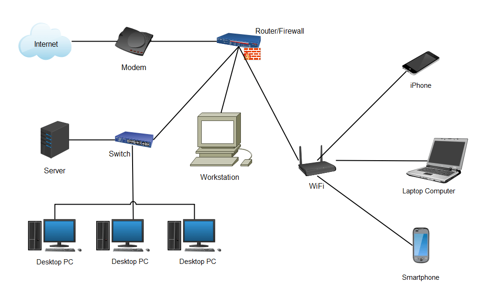
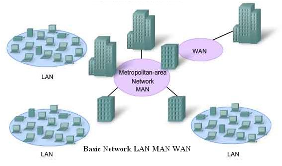

+++
pre = '<b>1. </b>'
title = 'Classifications'
draft = false
weight = "110"
+++

***

Il existe de nombreuses façons d'organiser les composants d'un réseau et gérer les transferts d'informations; les réseaux informatiques peuvent être classés selon plusieurs critères : en fonction de *leur taille et de leur étendue géographique*, mais aussi en fonction de *la façon dont les dispositifs sont connectés entre eux*.

### Classification en fonction de la taille et étendues

#### Réseau personnel (PAN)

**Les réseaux personnels**, ou **PAN** (*Personal Area Network*), permettent aux équipements de communiquer à l’échelle individuelle.

Un exemple courant est celui du réseau sans fil qui relie un ordinateur à ses périphériques. Pratiquement tous les ordinateurs s’accompagnent d’un moniteur, d’un clavier, d’une souris et d’une imprimante.

La connexion entre les équipements est soit câblées, soit sans fil. Sans câble, les équipements sans fil sont connectés par un protocole sans fil à courte portée nommé *Bluetooth*.

#### Réseau local (LAN)

**Un réseau local**, ou **LAN** (*Local Area Network*) est un réseau contenu au sein d'une zone géographique restreinte, généralement à l'intérieur d'un même bâtiment. Les réseaux WiFi domestiques et les réseaux de petites entreprises sont des exemples courants de réseaux LAN.

La plupart des LAN se connectent à Internet au niveau d'un point central : **un routeur**. Si les LAN domestiques passent souvent par un routeur unique, les réseaux LAN établis dans de grands espaces peuvent également faire usage de **commutateurs réseau** (*switch*) pour acheminer plus efficacement les paquets.

*Exemple de commutateur (switch)*

Les LAN s'appuient presque toujours sur Ethernet, le WiFi, ou les deux, pour connecter des appareils au réseau.

Une vaste gamme d'équipements peuvent se connecter aux réseaux LAN, notamment les serveurs, les ordinateurs de bureau, les ordinateurs portables, les imprimantes, les appareils IdO et même les consoles de jeu. Dans les bureaux, les LAN sont souvent utilisés pour assurer un accès partagé aux imprimantes ou aux serveurs connectés pour les collaborateurs internes.

#### Réseau métropolitain (MAN)

**Les réseaux métropolitains** (*Metropolitan Area Network*) permettent de connecter plusieurs LAN proches l’un de l’autre. Pour les relier entre eux, on fait appel à des routeurs et des câbles de fibre optique permettant des accès à très haut débit.

Un MAN est plus grand qu'un réseau local (LAN) mais plus petit qu'un réseau étendu (WAN) . Les MAN ne doivent pas nécessairement se trouver dans des zones urbaines ; le terme "métropolitain" implique la taille du réseau, et non la démographie de la zone qu'il dessert.

Ex: réseau du Cégep avec plusieurs campus.

#### Réseau étendu (WAN)

**Les réseaux étendus** (*Wide Area Network*) permettent de connecter plusieurs LAN éloignés entre eux.

La définition de ce qui constitue un WAN est assez large. Techniquement, tout réseau de grande taille qui s'étend sur une vaste zone géographique est un WAN (d’un état, un pays ou même la planète). Internet lui-même est considéré comme le plus vaste WAN.

### Classification en fonction des interconnexions

#### Architecture client-serveur

Un groupe d’ordinateurs, les clients, sont reliés à un serveur sur lequel tourne un système d’exploitation réseau. EX: Serveur de fichiers.

Les machines (clients) font des requêtes vers un serveur qui doit leur fournir le service demandé. Un serveur est généralement un ordinateur plus puissant que les machines des utilisateurs.

Les clients partagent des ressources communes gérées par le serveur sans pouvoir accéder aux ressources locales des différentes stations clientes.

La base de données des utilisateurs du réseau est centralisée sur un de ces serveurs et il est alors possible de contrôler l’accès aux ressources.

Enfin, il n’existe qu’un seul administrateur réseau.

Exemples d'architecture client/serveur : Windows Server 2012, Netware et Unix.

#### Architecture pair à pair (Peer to Peer)

Contrairement à une architecture client-serveur où les rôles de serveur et de client sont attribués définitivement, dans une architecture **pair à pair**, aussi notée **P2P**, tout ordinateur peut alternativement être serveur et client.

- Le réseau ne comporte pas de serveurs spécialisés ou dédiés.
- Le système d’exploitation est présent sur tous les postes.
- Aucun ordinateur n’a besoin d’être plus puissant qu’un autre.
- Regroupe en général peu de postes.
- Chaque utilisateur est administrateur de son propre poste.
- Demande des connaissances minimales pour travailler dans un environnement correctement structuré.

*Exemples: BitTorrent*