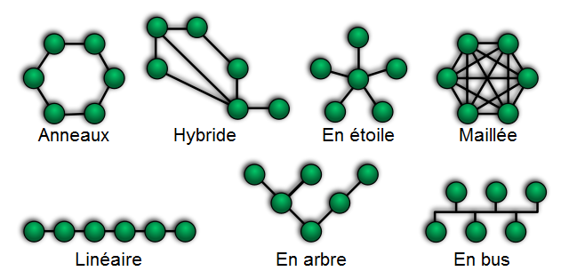
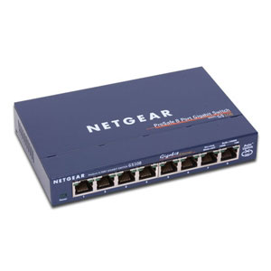
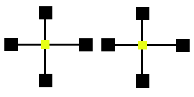
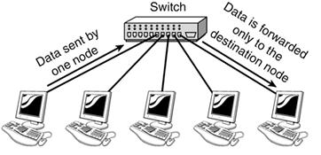

+++
pre = '<b>2. </b>'
title = 'Topologies'
draft = false
weight = "120"
+++

***

Il existe plusieurs manières de relier les ordinateurs et des dispositifs entre eux dans un réseau. Chaque manière a ses avantages et inconvénients. Afin de s'y retrouver, les réseaux peuvent être catégorisés par la manière dont les dispositifs y sont reliés. Leur connectivité porte un nom : c'est la **topologie du réseau**.

Dans ce chapitre, nous allons explorer les topologies réseaux les plus courantes. 

<!--  -->

<!-- - **Topologie point-à-point (point-to-point topology)**
- **Topologie maillée (mesh topology)**
- **Topologie en étoile (star topology)**
- **Topologie en bus (bus topology)**
- **Topologie en anneau (ring topology)**
- **Topologie en arbre (tree topology)**
- **Topologie hybride (hybrid topology)** -->

### Topologie point-à-point

**La topologie point à point (P2P)** connecte deux nœuds ou dispositifs (concentrateur, routeur, commutateur, etc.) directement à l'aide d'une ligne dédiée. Dans cette topologie, l'un des nœuds connectés sert d'émetteur, tandis que l'autre joue le rôle de récepteur.

Cette topologie est considérée comme le moyen le plus simple et le plus rentable de créer un réseau informatique, car elle ne nécessite qu'un seul canal de communication entre les deux nœuds connectés. En outre, cette topologie réserve la totalité de la bande passante de la connexion à la communication, ce qui minimise les risques d'encombrement et assure une connexion plus fiable.

*Exemples de topologie point-à-point :* 
+ Transfert de fichiers par Bluetooth entre deux appareils
+ Connexion directe par câble entre deux ordinateurs

### Topologie maillée

Dans une topologie maillée, chaque appareil est connecté à un autre appareil via un canal dédié.

Supposons que N appareils soient connectés les uns aux autres dans une topologie maillée, le nombre total de ports requis par chaque appareil est N-1. Dans la figure ci-dessus, il y a 5 dispositifs connectés les uns aux autres, le nombre total de ports requis par chaque dispositif est donc de 4. Le nombre total de ports requis = N * (N-1).

Supposons qu'un nombre N de dispositifs soient connectés les uns aux autres dans une topologie maillée, le nombre total de liens dédiés requis pour les connecter N(N-1)/2. Dans la figure ci-dessus, 5 appareils sont connectés les uns aux autres, le nombre total de liens nécessaires est donc de 5*4/2 = 10.

**Avantages**
+ Robuste
+ Fiable : Les données sont transférées par des canaux ou des liens dédiés
+ Sécurisé et assure la confidentialité
<!-- Questions intéressantes : Imaginons un réseau utilisant une topologie maillée contenant 3 dispositifs. De combien de ports avons-nous besoin? Combien de lignes dédiées? -->

### Topologie en étoile

Dans la **topologie en étoile**, tous les appareils sont reliés à un seul noeud central.

**Inconvénients**
+ Si le noeud central sur lequel repose toute la topologie tombe en panne, l'ensemble du système s'effondre *(single point of failure)*.
+ Les performances sont basées sur le noeud central.

*Exemples de topologie en étoile :* 
+ Réseau local (LAN) où tous les ordinateurs sont connectés à un commutateur (switch). 
+ Réseau sans fil où tous les appareils sont connectés à un point d'accès sans fil.

### Topologie en bus

Dans une **topologie en bus**, chaque périphérique du réseau est connecté à un seul câble. La communication est bidirectionnelle. Il s'agit d'une connexion multipoint et d'une topologie non robuste, car si l'épine dorsale tombe en panne, le réseau s'effondre.

**Avantages**
+ Si N appareils sont connectés les uns aux autres dans une topologie de bus, le nombre de câbles nécessaires pour les connecter est de 1.

**Inconvénients**
+ Si le câble commun tombe en panne, l'ensemble du système s'effondre.
+ Si le trafic réseau est important, il risque d'y avoir beaucoup de collisions (manque de fiabilité).
+ L'ajout de nouveaux noeuds ralentit la communication.
+ Faible sécurité.

### La topologie en anneau

Dans **les réseaux en anneaux**, chaque noeud est relié à deux autres : un suivant et un précédent. Les données transmises font le tour de l'anneau avant d'être détruites : elles se propagent d'un noeud au suivant, jusqu’à arriver au noeud de destination. Après réception de la donnée, le noeud de destination envoie un accusé de réception à l'émetteur, qui se propage dans le même sens que la donnée envoyée.

**Inconvénients**
- La défaillance d'un seul nœud du réseau peut entraîner la défaillance de l'ensemble du réseau.
- L'ajout ou la suppression de stations intermédiaires peut perturber l'ensemble de la topologie.

### Topologie hybride
Cette topologie est la combinaison de tous les types de topologies vues précédement.

{}
*Exemple de topologie hybride (combinaison de plusieurs topologies réseaux).*
{}

**Avantages**
- Très flexible.
- La taille du réseau peut être facilement étendue par l'ajout de nouveaux noeuds ou topologies.

**Inconvénients**
- La conception est difficile
- Le coût de l'infrastructure est très élevé

<!-- Un exemple courant de topologie hybride est le réseau d'un campus universitaire. Le réseau peut avoir un coeur en étoile, chaque bâtiment étant connecté au coeur par l'intermédiaire d'un commutateur ou d'un routeur. À l'intérieur de chaque bâtiment, il peut y avoir une topologie en bus ou en anneau reliant les différentes salles et les différents bureaux. Les points d'accès sans fil créent également une topologie maillée pour les appareils sans fil. Cette topologie hybride permet une communication efficace entre les différents bâtiments tout en offrant flexibilité et redondance à l'intérieur de chaque bâtiment. -->

### Topologie logique

À la base, une topologie réseau est une topologie physique : elle décrit comment les ordinateurs sont *physiquement* reliés. Mais il est possible d'émuler un réseau en bus, ou un réseau maillé avec une topologie en étoile. Cela nous pousse à faire la distinction entre la topologie physique, qui décrit comment les noeuds sont connectés, et la topologie simulée, appelée *topologie logique*.

#### Les topologies logiques en bus et maillées

Pour simuler un bus ou un réseau maillé à partir d'une topologie en étoile, il faut que l'équipement central soit un **commutateur** ou un **concentrateur**. 

{}
*Exemple de concentrateur (hub)*
{}

{}
*Exemple de commutateur (switch)*
{}

Ils sont tous deux des équipements réseaux avec plusieurs ports d'entrée/sortie, sur lesquels on vient connecter des composants réseaux : carte réseau, ordinateur, récepteur/émetteur WIFI, etc.

La différence entre concentrateur et commutateur est la topologie simulée : topologie en bus pour le concentrateur et topologie maillée pour un commutateur.

{}
*Différence entre concentrateur (à gauche) et commutateur (à droite).*
{}

Un concentrateur (hub) **redistribue chaque paquet reçu sur tous les autres ports**, sans se préoccuper de sa destination : **Il simule une topologie en bus**, alors que la topologie réelle est en étoile. De même pour un point d’accès sans-fil (WAP). 

Les commutateurs (switch) ont un fonctionnement similaire aux concentrateurs, si ce n'est qu'ils **n'envoient les données qu'au composant de destination**. Un commutateur **simule donc une topologie maillée** à partir d'une topologie en étoile : on retrouve la distinction entre topologie physique et logique.

{}
*Fonctionnement d'un commutateur.*
{}

### Vidéo résumé

