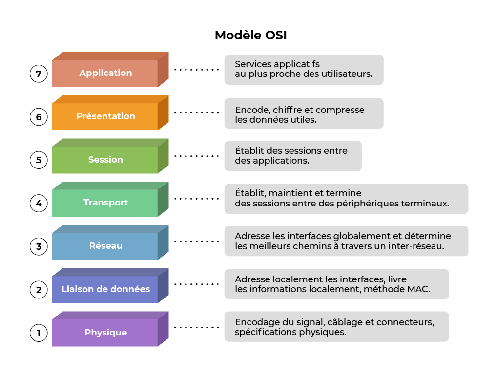

+++
pre = '<b>3. </b>'
title = 'Modèles OSI et TCP/IP'
draft = true
weight = "130"
+++

***

Un protocole est un ensemble de règles qui définissent comment différents systèmes communiquent entre eux.

Pour pouvoir communiquer entre elles, les personnes doivent se mettre d'accord sur des règles de communication. Ces règles (ou *protocoles*) doivent être respectés pour que le message soit correctement transmis et compris. 

Exemple : Qui veut lire ?

la communication les règles entre les hommes régissent. Ilesttrèsdifficiledecomprendredesmessagesquinesontpasbienformatésetquinesuiventpaslesrèglesetlesprotocolesétablis. A estruturada gramatica, da lingua, da pontuacaoe do sentancefaza configuracaohumanacompreensivelpormuitosindividuosdiferentes.

Il est très difficile de comprendre des messages qui ne sont pas bien formatés et qui ne suivent pas les règles/protocoles établis, n'est-ce pas :sweat_smile: ? Ce sont la grammaire, la langue, la ponctuation et la structure de la phrase qui permettent de comprendre une information.

<!-- Les protocoles utilisés dans les communications réseau partagent de nombreuses caractéristiques fondamentales avec les protocoles utilisés pour régir les conversations humaines. -->

De la même manière, pour que les hôtes d'un réseau puissent communiquer et s'échanger des données, il est nécessaire d'utiliser des protocoles informatiques et réseau communs qui vont définir la manière dont un message (ou donnée) est construit puis transmis.

## Modèles en couche
Théoriquement, il est possible d’utiliser un protocole unique qui prend les données d’une application informatique et les envoie à une application sur un autre ordinateur. Le problème avec cette approche est qu’elle est très rigide, car tout changement nécessite de modifier l’ensemble du protocole.

Pour ajouter de la souplesse et de l’efficacité, des modèles en couches (« *layers* ») ont été définis. Chaque protocole va appartenir à une couche précise et chaque couche va avoir une fonction différente des autres. Le grand intérêt des modèles en couches réside dans la séparation des fonctions : on va pouvoir modifier des protocoles ou utiliser un protocole d’une couche plutôt qu’un autre sans affecter les autres.

<!-- ### Avantages d'un modèle en couches
+ Aide à la conception d’un protocole, car des protocoles qui fonctionnent à un niveau de couche spécifique disposent d’informations définies à partir desquelles ils agissent, ainsi que d’une interface définie par rapport aux couches supérieures et inférieures.
+ Il encourage la concurrence, car les produits de différents fournisseurs peuvent fonctionner ensemble.
+ Il permet d’éviter que des changements technologiques ou fonctionnels dans une couche ne se répercutent sur d’autres couches, supérieures et inférieures.
+ Il fournit un langage commun pour décrire les fonctions et les fonctionnalités réseau. -->

Aujourd’hui, dans le monde réseau, il existe deux modèles largement dominants : le modèle OSI qui définit 7 couches et le modèle TCP/IP qui en définit 4.

### Le modèle OSI
Le modèle OSI (*Open Systems Interconnection* ou Interconnexion de Systèmes Ouverts en Français) est un modèle conceptuel dont le but est de définir des normes de communication entre différents systèmes informatiques. Il est normé en 1984.

Ce modèle propose un système de communication composé de 7 couches différentes. L’idée derrière cette représentation est une nouvelle fois de décomposer la communication entre deux périphériques en différentes « étapes » bien définies afin qu’on puisse par la suite faire évoluer les composants de chacune des couches de manière indépendante plutôt que de devoir modifier l’intégralité du processus de communication dès le changement d’un composant.

Les 7 couches définies par le modèle OSI :

Chaque couche résout un certain nombre de problèmes relatifs à la transmission de données, et fournit des services bien définis aux couches supérieures. Les couches hautes sont plus proches de l'utilisateur et gèrent des données plus abstraites, en utilisant les services des couches basses qui mettent en forme ces données afin qu'elles puissent être émises sur un médium physique.

### Le modèle TCP/IP
Le modèle TCP/IP (encore appelé « modèle Internet »), qui date de 1976, a été stabilisé bien avant la publication du modèle OSI en 1984.

Le modèle Internet a été créé afin de répondre à un problème pratique, alors que le modèle OSI correspond à une approche plus théorique, et a été développé plus tôt dans l'histoire des réseaux, sous l'influence et la surveillance des opérateurs télécoms, alors en position de force. Le modèle OSI est donc plus facile à comprendre, mais le modèle TCP/IP est le plus utilisé en pratique.

{}
TCP/IP est un modèle dérivé de l’ARPANET dont le but était de maintenir les communications coûte que coûte en cas d’attaque nucléaire. Il en découle un réseau basé sur le routage de paquets à travers une couche appelée Internet.
{}

Le modèle TCP/IP tient son nom de ses deux protocoles « majeurs » : les protocoles TCP (Transmission Control Protocol) et IP (Internet Protocol).

Il présente aussi une approche modulaire (utilisation de couches) mais en contient uniquement quatre :

### Vidéo explicative


#### Suite des protocoles
La suite des protocoles TCP/IP est l'ensemble des protocoles utilisés pour le transfert des données sur Internet. Elle est basée sur le modèle TCP/IP car chaque protocole est associé à une couche.

### L’encapsulation
Lorsque des données sont transmises sur le réseau, elles ne sont pas envoyées telles quelles, car chaque protocole a besoin d’informations bien précises pour faire son travail. Par exemple, les protocoles de couche liaison ont besoin d’informations particulières, non présentes dans la donnée de l'application, pour détecter les erreurs ou indiquer le récepteur. Même chose pour les protocoles TCP et UDP de la couche transport, qui ont besoin d’informations sur le processus émetteur et récepteur, qui ne sont pas dans la donnée à transmettre. 

Pour résoudre ce problème, chaque protocole ajoute les informations dont il a besoin à la donnée transmise en utilisant une méthode appelée **encapsulation**. Ces informations sont regroupées dans un en-tête, placé au début des données à transmettre. Avec cette méthode, les en-têtes de chaque couche sont séparés, placés les uns à côté des autres. Lors de la réception, ces en-tête seront enlevées dans l'ordre inverse, jusqu'à atteindre l'application de destination : c'est ce qu'on appelle la **désencapsulation**.

#### Unité de données de protocole (PDU)

Pour les couches liaison, réseau et transport, les paquets formés lors de l’encapsulation sont appelés des protocol data unit (PDU, unités de données d’un protocole, en français). Ils portent des noms différents selon la couche, vu qu’ils contiennent des en-têtes différents.

+ Pour la couche liaison, l’unité est la **trame**.
+ Pour la couche réseau, l’unité est le **paquet**.
+ Pour la couche transport, l’unité est le **segment**.

### Vidéo explicative
