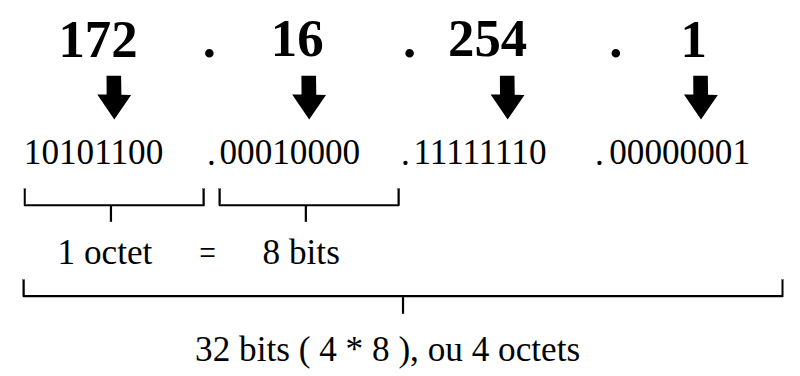

+++
pre = '<b>4. </b>'
title = 'Adressages'
draft = true
weight = "140"
+++

***

Pour envoyer une lettre par la poste, les relais postiers ont besoin de connaitre le nom et l'adresse de l'émetteur et du destinataire de la lettre, sans quoi ils ne sauront pas où distribuer le courrier. Sur les réseaux, un mécanisme similaire est utilisé : chaque ordinateur ou périphérique possède une adresse qui lui permet de recevoir ou envoyer des données sur le réseau.

## Types d'adresse
Il existe deux types d'adresse réseau :

+ **Adresses physiques :** Utilisées sur les réseaux locaux, mais qui ne sont pas compatibles avec les réseaux étendus et Internet (leur portée est limitée à un réseau local). Elles sont standardisées par le standard MAC (on les appelle adresses MAC)
+ **Adresses logiques :** Utilisées sur Internet et ont une portée très large, dépassant le réseau local de l’ordinateur. elles sont standardisées par le protocole IP (adresse IP). Utilité : Permet le remplacement d’un ordinateur sans pour autant changer son adresse internet. Par exemple, si un serveur tombe en panne et que l’on le remplace, il garde son adresse IP, alors que son adresse MAC change.

## Adresse MAC


{}
*Exemple d'adresse MAC*
{}

+ Elle se compose de six paires de nombres hexadécimaux pour un total de 12 nombres.
+ Également appelée adresse physique car elle est attribuée physiquement à la carte réseau d'un hôte.
+ Elle ne change pas et est unique.
+ Elle est similaire au nom d’une personne (analogie du courrier postal).

## Adresse IP


{}
*Exemple d'adresse IP*
{}

+ Elle se compose 4 nombres décimaux allant de 0 à 255. Chaque nombre décimal peut être représenté par un nombre binaire de 8 bits, pour un total de 32 bits ou 4 octets. 
+ Également appelée adresse logique, car elle est attribuée par logiciel.
+ Elle dépend de l’emplacement (logique) de l’hôte.
+ Elle est attribuée à chaque hôte par l’administrateur réseau (DHCP).
+ Elle est similaire à l’adresse d’une personne.

{}
L’adresse MAC physique et l’adresse IP logique sont toutes deux requises pour que des hôtes puisse communiquer dans un réseau (comme le nom et l’adresse d’une personne sont nécessaires dans la vie réelle pour envoyer une lettre).
{}

### Configuration réseau d'une machine

Une interface réseau est un point de connexion matériel (comme une carte réseau physique) ou logiciel qui permet à un appareil de communiquer avec un réseau, qu'il soit privé ou public, en envoyant et recevant des données. Cette interface possède obligatoirement une adresse MAC et optionnellement (si elle est configurée) une ou plusieurs adresses IP.

#### Commandes de base

##### `nmcli`

La commande `nmcli` permet de gérer les interfaces réseau d'une machine.

Pour lister les connections réseau :
```bash
nmcli dev
```
Pour afficher la configuration ip :
```bash
ip a
nmcli con show ens160
```

Pour configurer une adresse IP statique (au lieu de la recevoir dynamiquement) :
```bash
nmcli con mod ens160 ipv4.address 192.168.230.10/24
nmcli con mod ens160 ipv4.gateway 192.168.230.2
nmcli con mod ens160 ipv4.dns 8.8.8.8,8.8.4.4
nmcli con mod ens160 ipv4.method manual
nmcli con down ens160
nmcli con up ens160
```

Pour revenir en mode dynamique :
```bash
nmcli con mod ens160 ipv4.method auto
nmcli con mod ens160 ipv4.dns ""
nmcli con mod ens160 ipv4.gateway "" ipv4.addresses ""
nmcli con down ens160
nmcli con up ens160
```
Après avoir ajouté une interface réseau, il faut la déclarer dans nmcli
```bash
nmcli con add con-name ens224 type ethernet ifname ens224
```
Elle se configure ensuite à l’aide de DHCP ou avec une IP fixe.

#### `ifconfig`
`ifconfig` est un utilitaire de configuration du réseau.

```bash
ifconfig
```
affiche la liste des interfaces et des informations de configuration comme l’adresse IP et le masque de sous-réseau.

```bash
ifconfig <interface>
```
affiche la configuration d’une seule interface.

```bash
ifconfig <interface> down/up
```
permet de désactiver/activer une interface réseau.


### La commande ip

La commande `ip` remplace `ifconfig` qui devient obsolète.

`ip` est une commande beaucoup plus puissante que `ifconfig`.

Cette commande permet de modifier les paramètres IP des interfaces réseau mais uniquement de façon temporaire. Si l’ordinateur redémarre, les configurations seront perdues.

Pour rendre un configuration permanente, il faudra modifier les fichiers texte de configuration.

Cette commande reste néanmoins indispensable pour lire les configurations et tester de nouveaux paramètres.

Pour afficher la liste des interfaces:
```bash
ip address
```
ou
```bash
ip a
```

Pour une seule interface réseau:

$ ip a show <interface>
Pour redémarrer une interface pour que les nouveaux paramètres configurés dans les fichiers de configuration soient prises en comtpe:

$ ifdown <interface>
$ ifup <interface>
Il est possible de configurer plusieurs adresses IP sur une même interface à une condition: toutes les adresses IP doivent être dans le même sous-réseau.

Pour ajouter une adresse IP à une interface (ce ne sera pas permanent), il est possible d’ajouter plusieurs adresses IP à une interface:

$ ip addr add x.x.x.x /x dev <interface>
Exemple:

$ ip addr add 192.168.230.132/24 dev ens33
Pour la supprimer:

$ ip addr del x.x.x.x/x dev <interface>
Exemple:

$ ip addr del 192.168.230.132/24 dev ens33
Pour ajouter la passerelle par défaut:

$ ip route add default via x.x.x.x
Exemple:

$ ip route add default via 192.168.230.2
Pour afficher la liste des routes:

$ ip route

Le service réseau
Ce service gère le réseau sous Linux.

Lorsque vous modifiez les fichiers de configuration du réseau, un redémarrage du réseau est nécessaire.

Pour arrêter le service:

$ nmcli networking off
Pour démarrer le service

$ nmcli networking on
Exercice 1
Remplissez le tableau ci-dessous avec les paramres de votre machine :

Adresse IP	Masque de sous réseau	Passerelle par défaut	DNS1	DNS2
Est-ce que votre machine a une adresse IP statique ou dynamique (obtenue automatiquement)?

En utilisant la commande nmcli, donnez une adresse IP statique < votre machine en utilisant les paramètres que vous avez inscrit dans le tableau. Testez que tout fonctionne et que vous avez Internet apr avoir redémarré le réseau.

Revenez en arrière de façon que votre ordinateur obtienne son adresse IP automatiquement.

Testez que tout fonctionne.

Exercice 2
Ajoutez deux adresses IP à votre interface à l’aide de la commande ip, vous aurez donc 3 adresses IP différentes.

ATTENTION: les deux adresses doivent être dans le même réseau.

Configurez le fichier hosts pour que chacune des 3 adresses répondent aux ping avec un nom différent.

Quand vous redémarrez le service Network, est-ce que l’interface est toujours là?

Comment les rendre persistante? (Essayez de trouver la réponse au moins en théorie, testez le si vous le souhaitez).