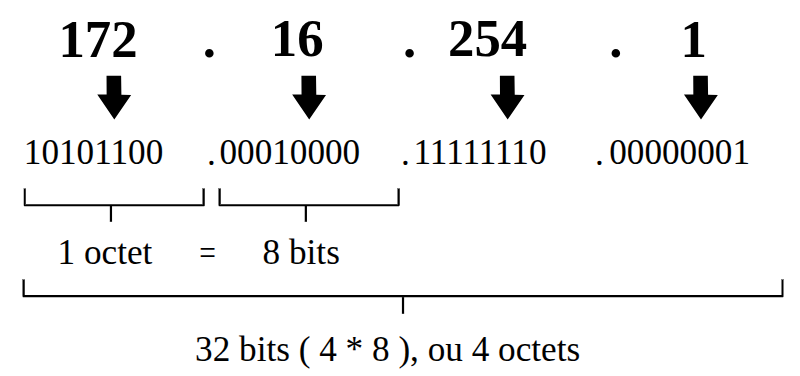

+++
pre = '<b>4. </b>'
title = 'Adressages'
draft = false
weight = "140"
+++

***

Pour envoyer une lettre par la poste, les relais postiers ont besoin de connaitre le nom et l'adresse de l'émetteur et du destinataire de la lettre, sans quoi ils ne sauront pas où distribuer le courrier. Sur les réseaux, un mécanisme similaire est utilisé : chaque ordinateur ou périphérique possède une adresse qui lui permet de recevoir ou envoyer des données sur le réseau.

## Types d'adresse
Il existe deux types d'adresse réseau :

+ **Adresses physiques :**  utilisées principalement sur les réseaux locaux (LAN). Elles sont associées à la carte réseau d'un appareil et sont utilisées à la **couche 2 du modèle OSI**. Il s'agit des **adresses MAC**.
+ **Adresses logiques :** utilisées pour permettre la communication entre différents réseaux. Elles sont utilisées à la **couche 3 du modèle OSI** et sont définies par le protocole IP. Il s'agit des **adresses IP**.

{}
On peut faire une analogie avec le courrier postal :

+ **Adresse MAC → nom de la personne** : permet d’identifier précisément un destinataire sur le réseau local.
+ **Adresse IP → adresse postale** : permet de déterminer sur quel réseau se trouve le destinataire et d’acheminer le courrier jusqu’à ce réseau.

Les deux adresses jouent donc des rôles différents et complémentaires.
{}

## Adresse MAC


{}
*Exemple d'adresse MAC*
{}

Une adresse **MAC (*Media Access Control*)** est une adresse utilisée à la **couche 2 (liaison de données) du modèle OSI**.

+ Elle est généralement composée de **six paires de chiffres hexadécimaux**, pour un total de **48 bits**.
+ Elle est associée à une interface réseau (carte réseau Ethernet, interface Wi-Fi, etc.).
+ Elle est généralement représentée sous une forme semblable à `00:1A:2B:3C:4D:5E`.
+ Elle est utilisée principalement pour la **communication à l’intérieur d’un réseau local (LAN)**.
+ Les **switches** utilisent les adresses MAC pour déterminer vers quel port transmettre une trame Ethernet.
+ Une adresse MAC est normalement unique au niveau mondial lorsqu'elle est attribuée par le fabricant, mais elle peut être modifiée ou usurpée par logiciel.


### Le rôle du switch

Lorsqu'un ordinateur envoie des données à un autre ordinateur situé sur le même réseau local, le **switch** examine l'adresse MAC de destination de la trame Ethernet.

Le switch possède une **table MAC** qui lui permet de savoir sur quel port se trouve chaque appareil. Il peut ainsi transmettre la trame uniquement vers le port approprié plutôt que de l'envoyer à tous les appareils du réseau.

## Adresse IP


{}
*Exemple d'adresse IP*
{}


Une adresse **IP** (*Internet Protocol*) est une adresse logique utilisée à la **couche 3 (réseau) du modèle OSI**.

Dans le cas d'**IPv4** :

+ Elle se compose de **4 nombres décimaux** allant de 0 à 255.
+ Chaque nombre décimal peut être représenté par un nombre binaire de **8 bits**, pour un total de **32 bits** ou **4 octets**.
+ Elle est attribuée à une interface réseau par configuration manuelle ou automatiquement, notamment à l'aide de **DHCP**.
+ Elle dépend de la configuration et de l'emplacement logique de l'hôte dans le réseau.
+ Contrairement à une adresse MAC, une adresse IP peut facilement changer, par exemple lorsqu'un appareil se connecte à un autre réseau.

### Le rôle du routeur

Les adresses IP permettent principalement aux **routeurs** d'acheminer les paquets d'un réseau à un autre.

Par exemple, lorsqu'un ordinateur du réseau `192.168.1.0/24` veut communiquer avec un serveur situé sur le réseau `10.0.0.0/24`, le paquet doit passer par un routeur.

Le routeur examine l'**adresse IP de destination** afin de déterminer vers quel réseau le paquet doit être acheminé.

{}
Le routeur travaille donc principalement avec les **adresses IP (couche 3)**.
{}

## MAC et IP : deux adresses, deux rôles

Lorsqu'un ordinateur communique sur un réseau, les adresses MAC et IP sont utilisées conjointement, mais elles ne servent pas au même objectif.


| -|Adresse MAC|	Adresse IP|
|-|-------------|------------|
| **Couche OSI**|	Couche 2 – Liaison de données	|Couche 3 – Réseau|
| **Type**	|Adresse physique|	Adresse logique|
| **Utilisée par**|	Switch	|Routeur|
| **Portée principale**|	Réseau local (LAN)|	Entre différents réseaux |
| **Exemple**|	`00:1A:2B:3C:4D:5E`|	`192.168.1.10`|
| **Identifie**	|Une interface réseau	|La position logique d'un hôte dans un réseau|
| **Unité de données**|	Trame|	Paquet|

{}

+ Le switch utilise les adresses MAC pour acheminer les trames à l'intérieur d'un réseau local.

+ Le routeur utilise les adresses IP pour acheminer les paquets d'un réseau à un autre.
{}

## Protocole ARP

Une question se pose alors : *si les applications utilisent des adresses IP et que le switch utilise des adresses MAC, comment un ordinateur connaît-il l'adresse MAC correspondant à une adresse IP ?*

C'est notamment le rôle du protocole **ARP (*Address Resolution Protocol*)**.

ARP permet à un appareil de trouver l'**adresse MAC associée à une adresse IPv4** sur son réseau local.

**Exemple**

Supposons que l'ordinateur `192.168.1.10` souhaite envoyer des données à `192.168.1.20`.

Il connaît l'adresse IP du destinataire, mais pour envoyer la trame Ethernet sur le réseau local, il doit également connaître son adresse MAC.

Il utilise alors ARP :

1. L'ordinateur `192.168.1.10` vérifie s'il connaît déjà la MAC associée à `192.168.1.20`.
2. Si ce n'est pas le cas, il envoie une **requête ARP** sur le réseau local.
3. La requête demande essentiellement :
"Qui possède l'adresse IP `192.168.1.20` ?"
4. L'appareil possédant cette adresse IP répond avec son adresse MAC.
5. L'ordinateur peut alors construire une trame Ethernet et l'envoyer au destinataire.


L'ordinateur conserve généralement cette association dans un **cache ARP** afin de ne pas avoir à effectuer une nouvelle requête pour chaque paquet.

On peut consulter ce cache avec des commandes telles que :
```bash
arp -a
```
ou, sur Linux moderne :
```bash
ip neigh
```

### ARP et les réseaux différents

ARP fonctionne sur le **réseau local** (LAN). Un ordinateur n'utilise pas ARP pour trouver directement la MAC d'un serveur situé sur Internet.

Par exemple, si `192.168.1.10` veut communiquer avec `8.8.8.8`, l'adresse IP de destination est située sur un autre réseau. L'ordinateur sait alors qu'il doit envoyer le paquet à sa **passerelle par défaut** (généralement le routeur).

Il utilise ARP pour trouver la **MAC de la passerelle**, et non celle du serveur `8.8.8.8`.
