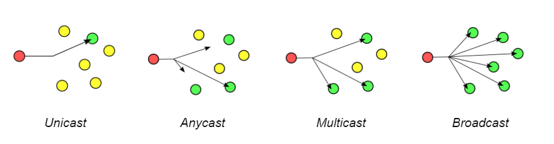

+++
pre = '<b>5. </b>'
title = 'Modes de transfert'
draft = false
weight = "150"
+++

***

Une transmission sur le réseau peut prendre différentes formes suivant le nombre de destinataires. Un hôte peut en effet vouloir communiquer avec un ordinateur bien précis, ou envoyer une donnée à plusieurs PC différents. Suivant le nombre de destinataires, on peut faire la différence entre *Unicast*, *Anycast*, *Multicast* et *Broadcast*.

+ **Unicast**: un ordinateur émet des données à destination d’un autre ordinateur bien identifié.

+ **Anycast**: un ordinateur émet des données vers un ordinateur qu’il ne connaît pas : l’émetteur ne connaît pas la destination de la donnée. L’ordinateur de destination n’est cependant pas choisi au hasard : c’est le protocole de routage qui choisit vers quel ordinateur émettre la donnée.

+ **Multicast**: les données émises sont envoyées à un groupe d’ordinateurs qui veulent recevoir cette donnée. Les ordinateurs qui veulent revoir la donnée se connectent à un serveur et s’inscrivent à un groupe de diffusion. Tous les ordinateurs inscrits dans ce groupe recevront la donnée émise. C’est notamment utilisé lors du streaming d’événements en live : on émet la donnée une fois, et celle-ci sera recopiée par les routeurs à toutes les personnes inscrites au groupe que le routeur connaît. Pour faire simple, le groupe possède une adresse logique (une IP) qui permet de l’identifier. Quand une donnée est envoyée à l’adresse du groupe, le serveur reçoit le paquet et en envoie des copies à tous les ordinateurs du groupe. L’adresse IP du serveur/groupe est appelée une adresse multicast.

+ **Broadcast**: le paquet émis est envoyé à tous les ordinateurs d’un réseau ou sous-réseau (un réseau local le plus souvent). Selon que le paquet se propage dans un réseau local ou sur internet, on distingue deux formes de broadcast.

