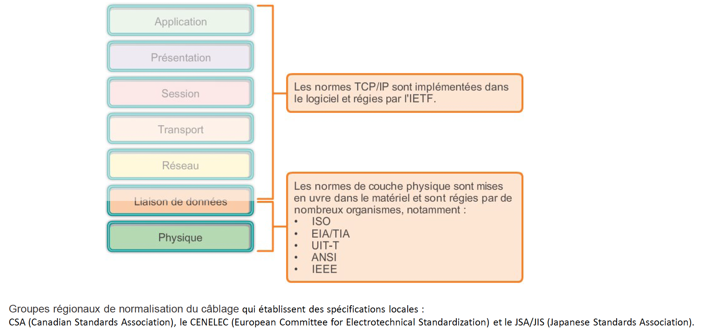

+++
pre = '<b>2. </b>'
title = "Rôle des couches basses"
draft = false
weight = "220"
+++

-----------------

## Couche physique
### Rôle

- Transmission physique des données entre deux équipements réseaux. 
- Tout ce qui a trait au bas-niveau, au matériel : la transmission des bits, leur encodage, la synchronisation entre deux cartes réseau, etc.
- Définit les standards des câbles réseaux, des fils de cuivre, du WIFI, de la fibre optique, ou de tout autre support électronique de transmission. 

### Normes
<!-- 
 -->

|Organisme de Normalisation|Normes réseau|
|---|---|
|ISO|ISO 8877: adoption officielle des connecteurs RJ (RJ-11 et RJ-45, notamment) ISO11801: norme de câblage réseau similaire à la normeEIA/TIA 568|
|EIA/TIA|TIA-568-C: normes de câblage de télécommunication utilisées par presque tous les réseaux de voix, de vidéo et de données TIA-569-B: normes des immeubles commerciaux pour les voies d'accès et les espaces de télécommunications TIA-598-C: code couleur de la fibre optique TIA-942: norme d'infrastructure de télécommunications pour les data centers|
|ANSI|568-C: brochage RJ-45 – Développée en collaboration avec les organismes EIA et TIA|
|UIT-T|G.992:ADSL|
|IEEE|802.3: Ethernet 802.11: LAN sans fil (WLAN) et maillé (certification Wi-Fi) 802.15: Bluetooth|

## Couche liaison de données
### Rôle
La couche liaison de données assure deux services de base :

- Accepter les paquets de couche 3 et les encapsuler dans des PDU appelées **des trames**.

- **Contrôler l'accès au support** et **détecter les erreurs**.

### Structure de trame de la couche 2

### Création d'une trame

Indicateurs de début et de fin de trame: ils sont utilisés par la sous-couche MAC pour identifier les limites de début et de fin de la trame.

- **Adressage :** utilisé par la sous-couche MAC pour identifier les noeuds source et de destination.

- **Type :** permet à la sous-couche LLC pour identifier le protocole de couche 3.

- **Contrôle :** permet d'identifier les services de contrôle de flux spécifiques.

- **Données :** contient les données utiles de la trame (le paquet).

- **Détection d'erreur :** inclus après les données pour constituer la fin de trame, ces champs de trame sont utilisés pour la détection des erreurs.

##### Concepts

- **Bande passante:** Capacité d'un support à transporter des données. La bande passante numérique mesure la quantité de données pouvant circuler d'un emplacement à un autre pendant une période donnée.

- **Débit:** Mesure du transfert de bits sur le support pendant une période donnée. De nombreux facteurs influencent le débit. Notamment: la quantité de trafic, le type de trafic, ou la latence créée par le nombre de périphériques réseau rencontrés entre la source et la destination.

<!--  -->