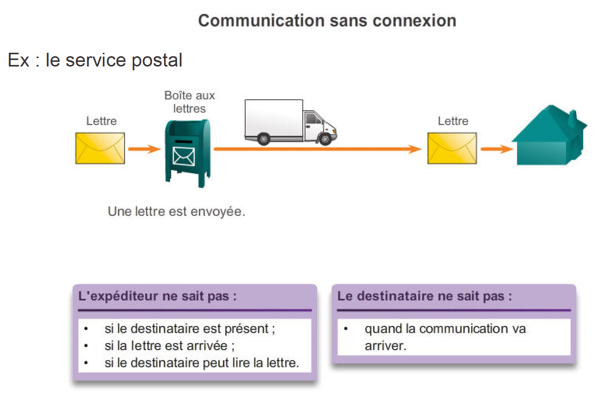
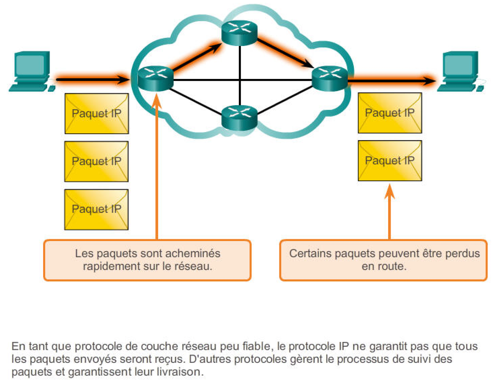
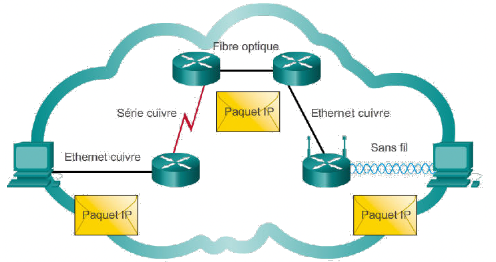
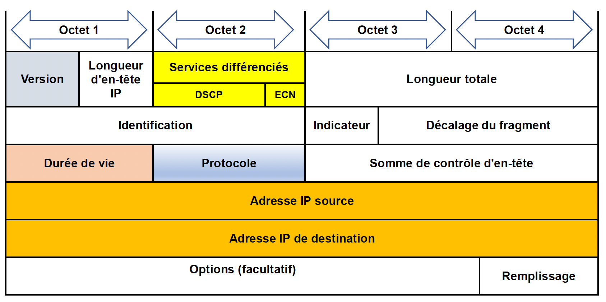

+++
pre = '<b>1. </b>'
title = "Protocole IP"
weight = "310"
+++
-------------------

## Caractéristiques

Les principales caractéristiques du protocole IP sont les suivantes:

+ **Sans connexion :** Aucun établissement de connexion avec la destination avant d’envoyer un paquet.

+ **Acheminement au mieux (peu fiable) :** Livraison de paquets non garantie.

+ **Indépendant du support :** Le fonctionnement est indépendant du support transportant les données.

### Sans connexion

### Acheminement au mieux

### Indépendant du support

### Exercice 
Lisez chaque description du protocole IP puis dites à quelle caractéristique elle correspond : 

+ Aucun contact n'est établi avec l'hôte de destination avant d'envoyer un paquet.
+ La livrtaison des paquets n'est pas garantie.
+ Envoie un paquet même si l'hôte de destination ne peut pas le recevoir.

## En-tête de paquet IPv4 (20 octets)

+ **Version :** contient une valeur binaire de 4bits indiquant la version du paquetIP. Pour les paquetsIPv4, ce champ est toujours 0100.

+ **Services différenciés (aussi appelé champ de type de service) :** un champ de 8bits utilisé pour définir la priorité de chaque paquet. 

<!-- Les 6 premiers bits définissent la valeur DCSP (DifferentiatedServices Code Point) qui est utilisée par un mécanisme de qualité de service. Les 2 derniers bits identifient la valeur de notification explicite de congestion qui peut être utilisée pour empêcher l’abandon de paquets pendant les périodes d’encombrement du réseau. -->

+ **Time-to-live (durée de vie, TTL) :**  contient une valeur binaire de 8bits utilisée pour limiter la durée de vie d’un paquet. Cette durée est indiquée en secondes mais est généralement appelée «nombre de sauts». L’expéditeur du paquet définit la valeur de durée de vie initiale et celle-ci diminue de un chaque fois que le paquet est traité par un routeur, ou effectue un saut. Si la valeur du champ TTL (durée de vie) arrive à zéro, le routeur rejette le paquet et envoie un message de dépassement de délai ICMP à l’adresseIP source. La commande tracerouteutilise ce champ pour identifier les routeurs utilisés entre la source et la destination.

+ **Protocole :** Vette valeur binaire de 8 bits indique le type de données utiles transportées par le paquet, ce qui permet à la couche réseau de transmettre les données au protocole de couche supérieure approprié. Les valeurs habituelles sont notamment ICMP (1), TCP (6) et UDP (17).

+ **Adresse IP source :** contient une valeur binaire de 32 bits qui représente l’adresse IP source du paquet.

+ **Adresse IP de destination :** contient une valeur binaire de 32 bits qui représente l’adresse IP de destination du paquet.

+ **Longueur d’en-tête Internet :** contient une valeur binaire de 4bits indiquant le nombre de mots de 32bits contenus dans l’en-tête. Cette valeur varie en fonction des champs d’options et de remplissage. La valeur minimale de ce champ est 5 (c.-à-d., 5x32=160bits=20octets) et la valeur maximale 15 (c.-à-d., 15x32=480bits= 60octets).

+ **Longueur de paquet :** Ce champ de 16 bits indique la taille globale du paquet, y compris l’en-tête et les données, en octets. Sa valeur minimale est de 20 octets (un en-tête de 20octets + 0octet de données) et sa valeur maximale est de 65535octets.

+ **Somme de contrôle de l’en-tête :** champ de 16 bits utilisé pour le contrôle des erreurs sur l’en-tête IP. 

<!-- La somme de contrôle de l’en-tête est recalculée et comparée à la valeur contenue dans le champ de somme de contrôle. Si les valeurs ne correspondent pas, le paquet est rejeté. -->

<!-- Un routeur peut devoir fragmenter un paquet lors de la transmission dudit paquet d’un support à un autre de MTU inférieure. Dans ce cas, la fragmentation se produit et le paquetIPv4 utilise les champs suivants pour suivre les fragments:

Identification ce champ de 16bits identifie de manière unique le fragment d’un paquetIP d’origine.

Indicateurs ce champ de 3bits indique la façon dont le paquet est fragmenté. Il est utilisé avec les champs de décalage du fragment et d’identification pour reconstituer le paquet d’origine.

Décalage du fragment ce champ de 13bits indique la position dans laquelle placer le fragment de paquet pour reconstituer le paquet d’origine. -->

