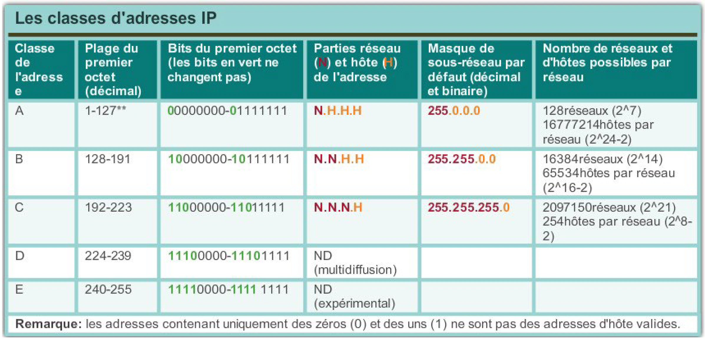

+++
pre = '<b>2. </b>'
title = "Adressage"
weight = "320"
+++
-------------------

**Rappel :** les adresses IPv4 sont composées de 4 octets (32 bits) notés sous forme de 4 nombres décimauxde 0 à 255 séparés par des points.

L’originalité de ce format d’adressage réside dans l’association de l’identification du réseau avec l’identification de l’hôte :

+ La partie *réseau* est commune à l’ensemble des hôtes d’un même réseau.

+ La partie *hôte* est unique à l’intérieur d’un même réseau.

## Masque de sous-réseau

Pour définir les parties réseau et hôte d’une adresse, les périphériques utilisent un modèle 32 bits distinct appelé masque de sous-réseau.

Le masque de sous-réseau ne contient pas réellement le réseau ou la partie hôte d’une adresse IPv4; il indique simplement où rechercher ces parties dans une adresse IPv4 donnée.

## Longueur du préfixe /x

## Monodiffusion et diffusion

+ **Monodiffusion (*unicast*) :** Consiste à envoyer un paquet d’un hôte à un autre

+ **Diffusion (broadcast) :** Consiste à envoyer un paquet d’un hôte à tous les hôtes du réseau. Deux types :
    + **Diffusion limitée :** Utilisée dans le même sous réseau. Limite : **les routeurs ne transmettent pas une diffusion limitée** (voir l’exemple de image)!
    + **Diffusion dirigée :** Utilisée pour atteindre d’autres réseaux que le leréseau dont on ait.E xemple : pour atteindre le réseau `172.16.4.0/24` depuis un autre réseau que celui-ci, on en envoi à l’IP de diffusion de ce réseau, donc à 172.16.5.255.

<!-- + **Multidiffusion  (multicast):** Quelques exemples de transmission multidiffusion : Diffusions vidéo et audio, Échange d’informations de routage entre des protocoles de routage, Distribution de logiciels, Jeu en ligne etc... -->

## Types d’adresses IPv4
### Adresses publiques et privées
#### Adresses privées
Les hôtes qui n’ont pas besoin d’accéder à Internet peuvent utiliser des adresses privées

+ `10.0.0.0` à `10.255.255.255` (`10.0.0.0/8`)

+ `172.16.0.0` à `172.31.255.255` (`172.16.0.0/12`)

+ `192.167.0.0` à `192.168.255.255` (`192.168.0.0/16`)

<!-- ### Adresses d’un espace d’adressage partagé
Ne sont pas globalement routables

Destinées uniquement à un usage dans les réseaux des fournisseurs de services.

Bloc d’adresses: 100.64.0.0/10 -->

#### Adresses réservées

## Adressage par classe

### Limite de l'adressage par classe

+ **CIDR :** Un nouvel ensemble de normes a été créé pour permettre aux fournisseurs de services d’allouer les adresses IPv4 sur n’importe quelle limite binaire (longueur de préfixe) plutôt que seulement avec une adresse de classe A, B ou C.