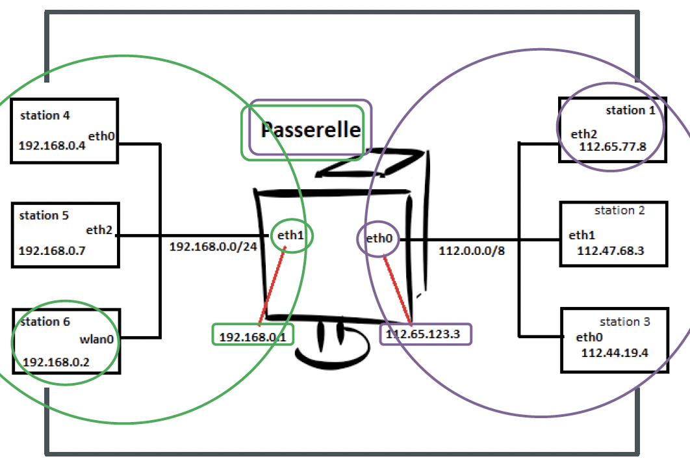

+++
pre = "<b>3. </b>"
title = "Routage"
weight = "340"
draft = false
+++
-------------------

Le routage est un processus qui permet de sélectionner des chemins (routes) dans un réseau pour transmettre des données depuis un expéditeur jusqu’à un ou plusieurs destinataires.

Un hôte peut envoyer un paquet à :

+ **Lui-même :** il s'agit d'une adresse IP spécifique,`127.0.0.1`, appelée *interface de bouclage* (*loopback*). Cet adresse est utile à des fins de test. Toute adresse IP appartenant au réseau `127.0.0.0/8` se rapporte à l'hôte local.

+ **Hôte local :** un hôte sur le même réseau que l'hôte émetteur (ils partagent la même adresse réseau).

+ **Hôte sur un réseau distant** (ils ne partagent pas la même adresse réseau).

## Fonction de routage
Pour qu'une machine puisse envoyer des paquets à un hôte d'un autre réseau, elle doit être dotée :

+ D’une seule route par défaut afin de pouvoir sortir vers l’extérieur, ou
+ D’une route statique identifiée vers chaque sous-réseau.

{}
Sur une machine, on peut configurer plusieurs routes statiques et une seule route par défaut.
{}

Une route définie sur une station est un chemin que doivent emprunter les paquets à destination d’un réseau.

Soit l’exemple (en image) d’une station, appelée *station 1*, d’adresse IP `112.65.77.8` sur un réseau `112.0.0.0/8` :



+ Elle est connectée à une passerelle qui a pour IP dans ce réseau `112.65.123.3` sur son interface `eth0`.

+ La passerelle est aussi connectée au réseau `192.168.0.0/24` via son interface `eth1` qui a pour IP `192.168.0.1`. Si la *station 1* veut communiquer directement avec la *station 6*, d’adresse IP `192.168.0.2` sur le réseau `192.168.0.0/24`, trois condition doivent être réunies :

+ Une route doit être définie sur la *station 1* indiquant que les paquets à destination du réseau `192.168.0.0/24` doivent passer par la passerelle `112.65.123.3`. Pour cela, on peut utiliser la commande `route` :
```bash
$ route add -net 192.168.0.0/24 gw 112.65.123.3
```
+ Une route doit être définie sur la station 6 indiquant que les paquets à destination du réseau `112.0.0.0/8` doivent passer par la passerelle `192.168.0.1` ; pour cela, on peut utiliser la commande `route` :
```bash
$ route add -net 112.0.0.0/8 gw 192.168.0.1
```
La passerelle doit être configurée pour transmettre (ou forwarder) les paquets IP d’un réseau à l’autre, ce qui se fait par la commande :
```bash
$ echo 1 > /proc/sys/net/ipv4/ip_forward
```
ou
```bash
$ sysctl -w net.ipv4.ip_forward=1
```
ou de façon permanente en ajoutant dans le fichier `/etc/sysctl.conf` la ligne : 
```bash
net.ipv4.ip_forward=1
```

Toute la configuration précédente est à refaire si on redémarre la machine. Afin d’éviter qu’à chaque redémarrage on doit retaper à nouveau toutes les commandes précédentes, on peut les mettre dans des scripts d’initialisation au démarrage avec la commande `update-rc.d` (sous *Debian/Ubuntu*) ou `chkconfig` (*Redhat/Alma/Rocky*).

Pour ajouter un script `my_ script` à l’initialisation :
```bash
$ mv my_script /etc/init.d
$ update-rc.d my_script defaults # sous debian/ubuntu
$ chkconfig --add my_script # sous redhat/alma/rocky
```

Dans le cas de cette topologie, on aurait pu remplacer la route statique définie précédemment dans les stations 1, 2 et 3 par une route par défaut.

La configuration d’une route par défaut peut se faire par l’une des méthodes suivantes :

+ Définir une passerelle par défaut (gateway)
```bash
$ ip route add default via 112.65.123.3
```
+ Ou rajouter la route en utilisant la commande :
```bash
$ route add -net 0.0.0.0/0 gw 112.65.123.3
```
+ De même du coté des stations 4, 5 et 6 vers la gateway `192.168.0.1`.
