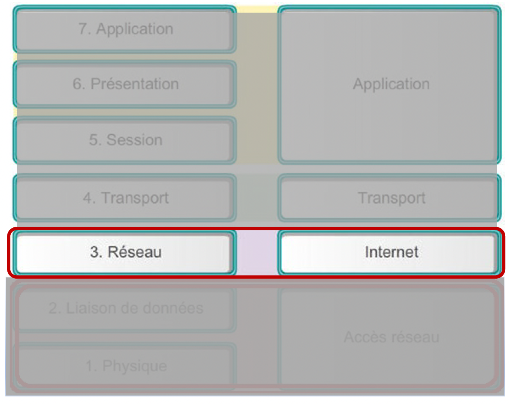

+++
pre = '<b>3. </b>'
title = "Couche internet"
weight = "300"
+++
-------------------

Ce chapitre porte sur le rôle de la couche réseau (modèle OSI) ou Internet (modèle TCP/IP) . Il examine comment cette dernière divise les réseaux en groupes d’hôtes pour gérer le flux de paquets de données dans un réseau.

Ce chapitre aborde également la communication entre les réseaux (appelée routage) ainsi que l’adressage IP.

## Rôles
La couche réseau/internet utilise trois processus de base :

**Adressage des périphériques finaux :** Les périphériques finaux doivent être configurés avec une adresse IP unique pour être identifiés sur le réseau. Un périphérique final disposant d’une adresse IP est qualifié *d’hôte*.

**Encapsulation/Désencapsulation :** La couche réseau reçoit une unité de données de protocole (PDU) de la couche transport. Dans le cadre du processus **l’encapsulation**, la couche réseau ajoute des informations d’en-tête IP, telles que l’adresse IP des hôtes source (expéditeur) et de destination (destinataire). Une fois les informations d’en-tête ajoutées à la PDU, celle-ci est appelée **paquet**. Lorsque le paquet arrive au niveau de la couche réseau de l’hôte de destination, l’hôte vérifie l’en-tête du paquet IP. Si l’adresse IP de destination dans l’en-tête correspond à l’adresse IP de l’hôte qui effectue la vérification, l’en-tête IP est supprimé du paquet. Ce processus de suppression des en-têtes des couches inférieures est appelé **la désencapsulation**. Une fois la désencapsulation effectuée par la couche réseau, la PDU de couche 4 est transmise au service approprié au niveau de la couche transport.

**Routage :** La couche réseau fournit des services permettant de diriger les paquets vers un hôte de destination sur un autre réseau. Pour voyager vers d’autres réseaux, le paquet doit être traité par **un routeur**. Le rôle du routeur est de sélectionner les chemins afin de diriger les paquets vers l’hôte de destination. Ce processus est appelé **le routage**. Un paquet peut passer par de nombreux périphériques intermédiaires avant d’atteindre l’hôte de destination. 

## Protocoles de la couche réseau
+ **IP** (*Internet Protocol*)

+ **ICMP** (*Internet Control Message Protocol*)

+ **RIP** (*Routing Information protocol*)

+ **EIGRP** (*Enhanced Interior Gateway Routing*)

+ **OSPF** (*Open ShortestPath First*)