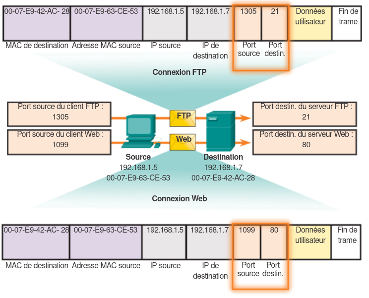

+++
pre="<b>1. </b>"
title = "Adressage de port"
weight = "410"
+++
-------------------

+ Les protocoles de transport (TCP et UDP) utilisent des **numéros de port** pour permettre à plusieurs applications/processus de communiquer simultanément sur un même hôte. 

+ Chaque segment ou datagramme contient : un port source et un port de destination. Le port de destination informe le service (application) demandé. 

+ **Exemple -** si un client demande un service web, il envoie un message vers le port de destination 80 (HTTP) sur le serveur. Le serveur sait alors qu’il doit traiter un service Web. 

+ Le port source est généré aléatoirement (dans une certaine plage) par le client afin d’identifier sa propre application et permettre le retour de la réponse vers la bonne application. 

## Plages de ports

+ L’IANA (*Internet Assigned Numbers Authority*) est responsable de l’attribution des numéros de port. 

Il existe trois plages principales :
|Plage de numéros de ports|Groupe de ports  |
|--------------------|-----------------|
|0 à 1023                 | Ports réservés  |
|1024 à 49151             | Ports inscrits  |
|49152 à 65535            | Ports dynamiques|

+ **Ports réservés (0 à 1023):** utilisés pour des services serveurs bien connus (HTTP : 80, FTP : 21, SMTP : 25, etc.). 

+ **Ports inscrits (1024 à 49151) :** affectés à des applications utilisateurs ou moins standardisées. 

+ **Ports dynamiques/privés (49152 à 65535):** souvent utilisés comme ports sources par les clients, dits "*éphémères*". 

+ Exemples de ports:
    + TCP : 21, 23, 25, 80, 443 sont dans la plage "réservée". 
    + UDP : 69 (TFTP), 520 (RIP) sont dans "réservés". 
    + TCP & UDP : 53 (DNS), 161 (SNMP). 

## Sockets

Une socket est la combinaison de : l’adresse IP (source ou destination) + numéro de port (source ou destination) + protocole de transport (TCP ou UDP) — ce qui permet d’identifier de façon unique un point de communication. 

+ Une paire de sockets (source & destination) **identifie une conversation spécifique entre deux hôtes** : par exemple, client `192.168.1.5:1099` et serveur `192.168.1.7:80` constituent une paire. 

+ Les sockets permettent simultanément :
    + à plusieurs processus sur le client de mener diverses requêtes (chacun avec un port source différent)

    + au serveur de distinguer plusieurs connexions entrantes vers le même service (du même client ou de clients différents) grâce à la combinaison adresses/ports. 

### Exemple de communication

## Vérification/surveillance de ports

L’utilitaire `netstat` permet de voir les connexions actives, les adresses locales/distantes + numéros de ports + état de la connexion. 

Cela permet de détecter des connexions "inexpliquées" ou suspectes, ou d’analyser des performances réseau. 