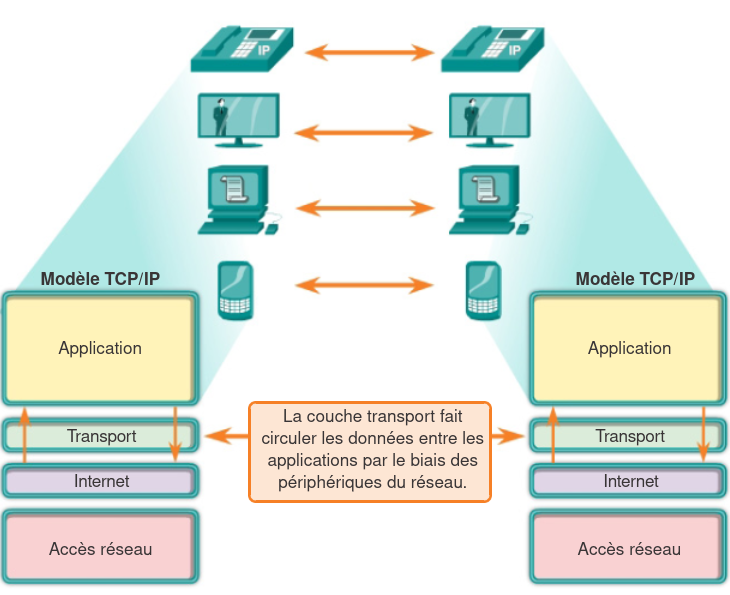
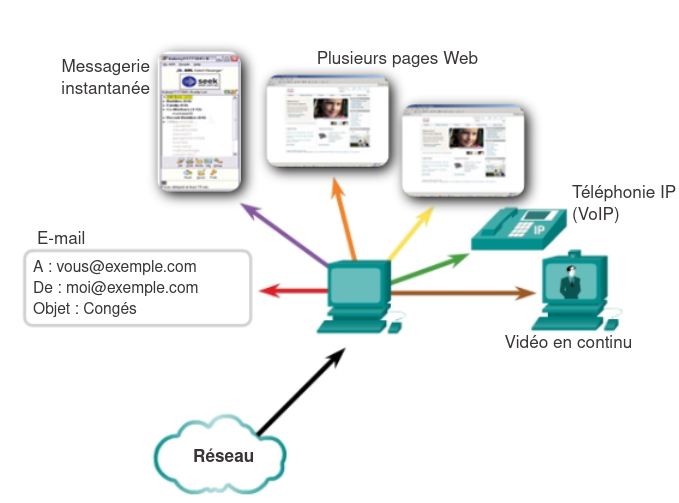
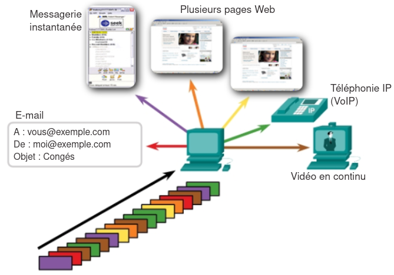
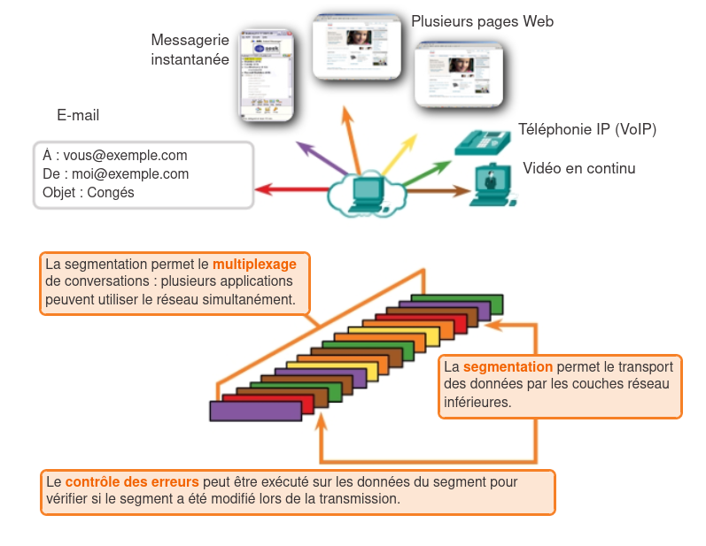
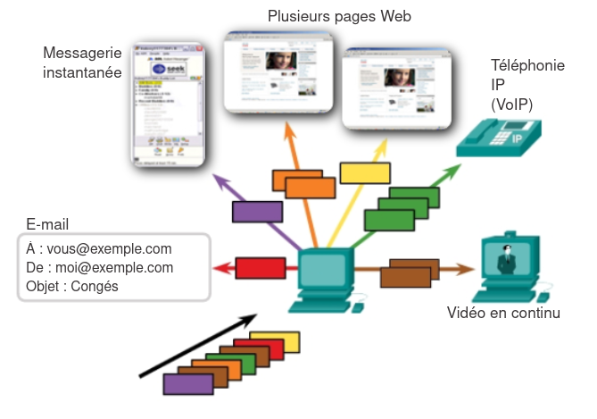
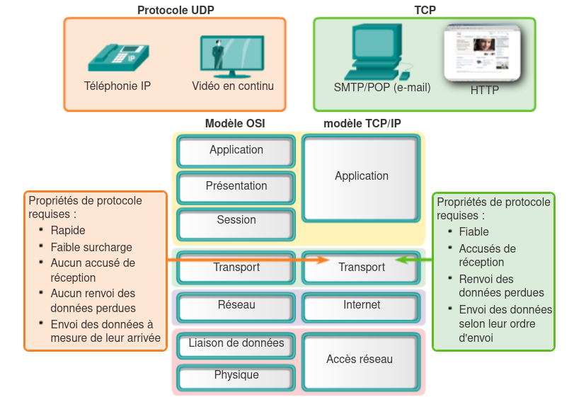

+++
pre = '<b>4. </b>'
title = "Couche transport"
weight = "400"
+++
-------------------

Dans le chapitre précédent, nous avons vu que la couche Internet permettait (entre autres) de transmettre des paquets d'un périphérique source à un périphérique de destination grâce à l'adressage IP.

Mais lorsqu'une donnée arrive à un ordinateur, comment savoir à quelle application est-elle destinée ?   

La couche transport est chargée de l’établissement d’une session de communication temporaire **entre deux applications** et de l’acheminement des données entre ces deux applications.

## Rôle

La couche tranport est responsable de trois tâches :

+ Suivi des conversations individuelles
+ Segmentation des données et reconstruction des segments
+ Identification de l’application appropriée pour chaque flux de communication

### Suivi des conversations individuelles

Chaque ensemble de données transitant entre une application source et une application de destination est appelé *une conversation*. Un hôte peut héberger plusieurs applications qui communiquent sur le réseau simultanément. Chacune de ces applications communique avec une ou plusieurs applications sur un ou plusieurs hôtes distants. La couche transport est chargée de **garantir ces multiples conversations** et d’**en effectuer le suivi**.

### Segmentation et reconstitution de données

+ **Lors de l'encapsulation :** la couche transport segmentent les données d’application en blocs de données de taille appropriée. Un en-tête, (utilisé pour la réorganisation), est ajouté à chaque bloc de données.

+ **Au niveau du destinataire (désencapsulation):** La couche transport reconstitue le flux de données à partir de ses segments, grâce aux informations contenues dans les en-têtes.

#### Multiplexage

+ L’envoi de certains types de données (par exemple, un flux vidéo en continu) sur le réseau en tant que flux de communication complet peut utiliser toute la bande passante disponible et empêcher d’autres communications d’avoir lieu en même temps.

+ La segmentation des données en parties plus petites permet d'avoirs plusieurs communications différentes provenant de nombreux utilisateurs, d’être imbriquées (*multiplexées*) sur le même réseau. 
+ Sans segmentation, une seule application pourrait recevoir des données.
    + Exemple: Pour un flux vidéo en continu (*stream*), le support serait monopolisé par le flux de communication au lieu d’être partagé. Il serait impossible de recevoir des e-mails, de parler sur une messagerie instantanée et d’afficher des pages Web tout en regardant la vidéo.

### Identification des applications

De nombreux services ou applications peuvent s’exécuter en même temps sur chaque hôte du réseau. Pour que les flux de données atteignent la bonne application, la couche transport identifie l'application en lui affectant un identificateur qu'on appelle **numéro de port**. Chaque processus logiciel ayant besoin d’accéder au réseau se voit affecter un numéro de port unique sur son hôte.

### Le bon protocole pour une application

+ **TCP** et **UDP** sont les deux protocoles de la couche transport, chacun ayant des caractéristiques spécifiques.

+ Le choix entre TCP et UDP dépend des besoins et des exigences des applications ; les développeurs doivent décider quel protocole est le plus approprié dépendamment des besoins de leur application

#### TCP (Transmission Control Protocol)

+ Assure que les segments de données arrivent dans le bon ordre et que toutes les informations sont reçues correctement.
+ Garantit l’intégrité et la fiabilité des données transmises.
+ Convient aux applications qui nécessitent que toutes les données soient présentes et intactes pour fonctionner correctement.
+ Exemples d’applications : bases de données, navigateurs web, clients de messagerie électronique.
+ Avantages : assure la fiabilité de la communication et prévient toute perte de données.
+ Inconvénients : génère une surcharge réseau supplémentaire en raison des mécanismes d’accusés de réception et de retransmission des paquets manquants.

#### UDP (User Datagram Protocol) :

+ Offre une transmission plus rapide en réduisant la surcharge réseau.
+ Ne garantit pas la livraison de tous les paquets, mais privilégie la rapidité plutôt que la fiabilité.
+ Adapté aux applications qui peuvent tolérer la perte de quelques données sans impact significatif sur l’expérience utilisateur.

+ Exemples d’applications : streaming vidéo et audio, VoIP (voix sur IP).

+ Cas pratiques :
    + Flux vidéo : la perte de quelques segments peut entraîner une légère distorsion ou interruption momentanée, mais le flux global continue sans retard.
    + Radio sur Internet : si des paquets sont perdus, le son peut subir de petites interruptions, mais l’expérience reste acceptable ; l’utilisation de TCP ralentirait le flux et amplifierait les interruptions à cause des retransmissions.

#### Conclusion : TCP vs. UDP
+ TCP est privilégié pour les applications nécessitant une fiabilité totale.

+ UDP est privilégié pour les applications où la rapidité et la fluidité de la transmission sont plus importantes que la perte occasionnelle de données.