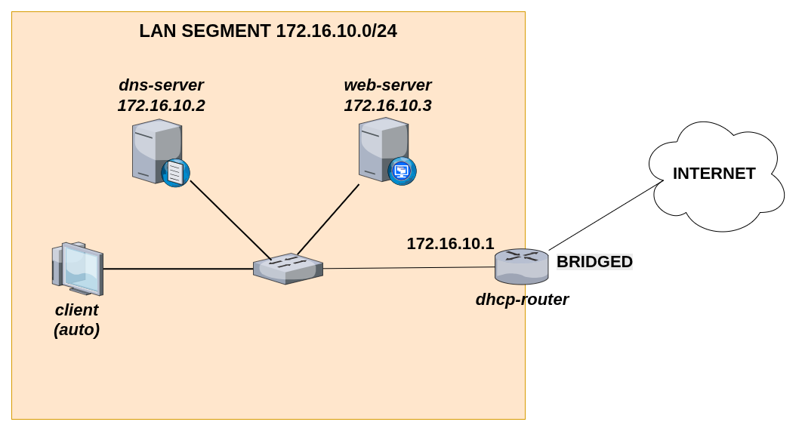
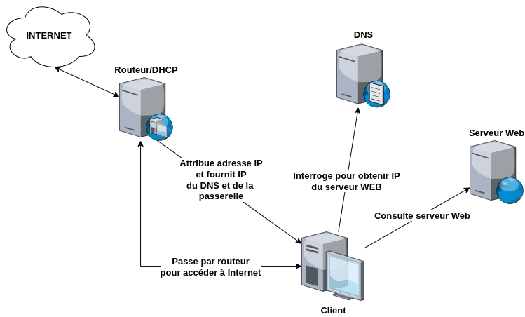

+++
pre = '<b>4. </b>'
title = "Atelier d'intégration"
weight = "540"
+++
-------------------

Dans ce laboratoire final, vous mettrez en pratique l’ensemble des notions vues dans le dernier chapitre en construisant un petit réseau local complet. Vous devrez déployer un LAN composé de 4 VMs jouant chacune un rôle précis : 
+ un serveur DHCP (**Kea**) faisant également office de **routeur**, 
+ un serveur DNS Bind récursif et autoritaire pour une zone donnée , 
+ un serveur Web Nginx hébergeant une page statique, et enfin
+ un poste client permettant de valider le bon fonctionnement de l’infrastructure. 

L’objectif de ce laboratoire est de vous amener à intégrer ces services, à comprendre leurs interactions et à diagnostiquer les problèmes potentiels d’un réseau réel. À la fin, vous aurez construit un environnement fonctionnel où chaque service dépend des autres, exactement comme dans un réseau réel.

La topologie/diagramme du réseau est la suivante :



+ **Adresse réseau -** `172.16.10.0/24`
+ **Serveur DHCP** 
    + Interface 1 (LAN):
        + Mode: *LAN SEGMENT*
        + IP: `172.16.10.1/24`
    + Interface 2 (WAN):   
        + Mode - *Bridged* 
+ **Serveur DNS**
    + Interface 1:
        + Mode: *LAN SEGMENT*
        + IP: `172.16.10.2/24`
+ **Serveur Web**
    + Interface 1:
        + Mode: *LAN SEGMENT*
        + IP: `172.16.10.3/24`

## Requis fonctionnels
Le diagramme suivant décrit les interactions entre les différentes machines :



### Exigences

+ **Routeur DHCP**
    + Le serveur DHCP doit faire office de routeur: il aura une interface dans le LAN Segment qui sera la **passerelle par défaut** du réseau et une autre en NAT/Bridged qui servira de "porte de sortie" vers internet (ce sera notre interface WAN).
    + Dans la configuration des plages d'adresses et options gérées par DHCP : 
        + La passerelle par défaut donnée aux client doit être l'adresse de son interface LAN: `172.16.10.1`.
        + L'adresse du serveur DNS donnée au client doit être celle du serveur DNS que l'on va configurer: `172.16.10.2`.
+ **DNS** 
    + Le serveur DNS doit accepter les requêtes récursives et être autoritaire pour la zone `votrenom.lan`.
    + Il doit y avoir au minimum 3 enregistrements pour la zone `votrenom.lan`:
        + `ns1` (A) avec l'adresse IP du serveur DNS: `172.16.10.2`
        + `dhcp` (A) avec l'adresse IP du serveur DHCP: `172.16.10.1`
        + `www` (A) avec l'adresse IP du serveur Web:`172.16.10.3`  
+ **Serveur Web**
    + Le serveur Web doit servir une application React simple de votre choix.

## Étapes d'implémentation

### Pré-requis
Créer les machines virtuelles sur VMWare :
+ `dhcp-router` (Rocky/Alma Linux) avec 2 adaptateurs réseau: un en LAN Segment (LAN), et un en NAT ou Bridged (WAN).
+ `dns-server` (Rocky/Alma Linux) avec un adaptateur réseau en LAN Segment
+ `web-server` (Ubuntu) avec un adaptateur réseau en LAN Segment.
+ `client` (OS de votre choix)- avec un adaptateur réseau en LAN Segment.

{}
Afin de pouvoir télécharger et installer les services `bind` et `nginx` dans les machines `dns-server` et `web-server`, il est nécessaire de temporairement mettre leur adaptateur réseau en NAT ou Bridged pour avoir accès à internet lors de la configuration. Ensuite, une fois que tout est configuré, changez le mode en LAN Segment et configurez leur interface de façon statique.

Il n'est donc pas nécessaire de faire cela pour le serveur DHCP car il a déjà accès à internet via son interface WAN. 
{}

### Configuration du routeur DHCP
#### Partie DHCP
1. Changer son *hostname* (optionnel, seulement pour se repérer) :
```bash
sudo hostnamectl set-hostname dhcp-router 
```
2. Configurer l'interface LAN :
```bash
sudo nmcli con add con-name ens224 type ethernet ifname ens224
sudo nmcli con mod ens224 ipv4.address 172.16.10.1/24
sudo nmcli con mod ens224 ipv4.method manual
sudo nmcli con down ens224
sudo nmcli con up ens224
```
<!-- 3. Désactiver le pare-feu
```bash
sudo systemctl stop firewalld
sudo systemctl disable firewalld
``` -->
3. Installer *ISC-Kea*
```bash
sudo dnf install kea
```
4. Modifier le fichier de configuration `/etc/kea/kea-dhcp4.conf` :
```json
{
# La configuration DHCP (v4) commence
"Dhcp4": {

# Variables globales
  # Durée du bail (s) - 1 semaine
  "valid-lifetime": 604800,
  # Durée avant demande de renouvellement (s)
  "renew-timer": 604800,
  # Durée avant demande de resynchronisation (1 jour)
  "rebind-timer": 86400,

  # Configuration des interfaces utilisées par le serveur
  "interfaces-config": {
      "interfaces": [ "ens224" ]
  },

  # Définition de la BD des bails
  "lease-database": {
    "type": "memfile",
    "persist": true,
    "name": "/var/lib/kea/dhcp4.leases"
  },

  # Configuration de la liste des réseaux 
  "subnet4": [
    {
      "id": 1,
      "subnet": "172.16.10.0/24",
      "pools": [
        {
          "pool": "172.16.10.4 - 172.16.10.254"
        }
      ],
	  "option-data": [
	    {
		  "name": "domain-name-servers",
          "data": "172.16.10.2",
		  "always-send": true
        },
	    {
          "name": "routers",
          "data": "172.16.10.1",
		  "always-send": true
        },
	  ]
    }
  ]
}
}
``` 
{}
Il est aussi possible de créer des réservations pour le serveur DNS et Web. Cependant, je vous déconseille de le faire dans le cadre de ce laboratoire pour les raisons suivantes :
+ Lorsqu'on configure des VMs sur *VMWare Workstation*, à chaque fois qu'on ouvre nos VMs dans un nouveau poste de travail/PC, il est possible que les adresses MAC de nos interfaces changent. 
+ Vous serez donc contraints de changer les réservations dans votre DHCP à chaque fois que vous changez de poste...
{}

5. Démarrer le service et faire en sorte qu'il soit actif à chaque redémarrage de la machine : 
```bash
sudo systemctl enable kea-dhcp4 # automatiquement actif à chaque reboot
sudo systemctl start kea-dhcp4 # démarrage du service
```
6. Vérifier l'état du service (*active* et *enabled*)
```bash
sudo systemctl status kea-dhcp4
```
6. (bis) Si le démarrage du service échoue : 
    + Vérifier les logs pour détecter les erreurs : 
    ```bash
    sudo journalctl -xeu kea-dhcp4
    ```
    + Corriger le fichier de configuration puis redémarrez le service : 
    ```bash
    sudo systemctl restart kea-dhcp4
    ```

#### Partie routeur
1. Activer le "forwarding" des paquets de façon permanente en ajoutant la ligne `net.ipv4.ip_forward=1` au fichier `/etc/sysctl.conf`:
```bash
sudo nano /etc/sysctl.conf # option 1
# ou
echo "net.ipv4.ip_forward=1" | sudo tee -a /etc/sysctl.conf # option 2

sudo sysctl -p /etc/sysctl.conf # appliquer les changements
```
2. Mettre en place les règles de pare-feu pour accepter les requêtes DHCP et le masquerade NAT (*NAT masquerading*): 
```bash
sudo firewall-cmd --zone=public --add-masquerade --permanent
sudo firewall-cmd --zone=public --add-service=dhcp --permanent
sudo firewall-cmd --reload
```

#### Test
Démarrer la VM client. Vérifier qu'elle reçoit la bonne configuration IP du DHCP  et qu'elle peut faire des requêtes à internet : 
```bash
ip a # vérifier qu'une adresse IP lui a été assignée automatiquement 
ip route # vérification de la bonne passerelle par défaut
nmcli # vérification de l'adresse du serveur DNS  
ping 8.8.8.8 # test d'accès à internet
```
+ Question : À votre avis, pourquoi `ping www.google.com` ne fonctionne pas à cet étape du laboratoire ?

### Serveur DNS
1. Changer son *hostname* (optionnel, seulement pour se repérer) :
```bash
sudo hostnamectl set-hostname dns-server 
```

<!-- 3. Désactiver le pare-feu
```bash
sudo systemctl stop firewalld
sudo systemctl disable firewalld
``` -->
3. Installer *bind*
```bash
sudo dnf install bind
```
4. Créer le fichier de zone `/var/named/votrenom.lan` pour la zone `votrenom.lan` :
```bash
$TTL 3H
@	IN SOA	@ admin.votrenom.lan. (
					1	; serial
					1D	; refresh
					1H	; retry
					1W	; expire
					3H )	; minimum
@	IN	NS	ns1.votrenom.lan.
ns1	IN	A	172.16.10.2
www	IN	A	172.16.10.3
```
6. Modifier le groupe du fichier à `named`: 
```bash
sudo chgrp named /var/named/votrenom.lan
```
7. Modifier le fichier de configuration `/etc/named.conf` :
    + Modifier listen on à any
    + Modifier allow-query à any
    + Ajouter la déclaration de la zone `votrenom.lan` à la fin du fichier:
    ```bash
    zone "votrenom.lan" {
        type primary;
        file "votrenom.lan";
    };
    ``` 
6. Démarrer le service et faire en sorte qu'il démarre automatiquement à chaque reboot : 
```bash
sudo systemctl enable named # démarre automatiquement à chaque reboot
sudo systemctl start named # démarrage du service
```
7. Vérifier l'état du service (*active* et *enabled*)
```bash
sudo systemctl status named
```
7. (bis) Si le démarrage du service échoue : 
    + Vérifier les logs pour détecter les erreurs : 
    ```bash
    sudo journalctl -xeu named
    ```
    + Corriger le fichier de configuration puis redémarrez le service : 
    ```bash
    sudo systemctl restart named
    ```

8. Configurez le pare-feu pour autoriser les requêtes DNS :
    + Option 1: désactiver simplement le pare-feu :
    ```bash
    sudo systemctl stop firewalld
    sudo sytemctl disable firewalld
    ```
    + Option 2 (meilleure): ajouter une règle pour autoriser les requêtes DNS :
    ```bash
    sudo firewall-cmd --zone=public --add-service=dns --permanent
    sudo firewall-cmd --reload
    ```

#### Test
1. Vérifiez que vous pouvez faire des requêtes au serveur en `localhost`:
```bash
dig @172.16.10.2 ns1.votrenom.lan
dig @172.16.10.2 dhcp.votrenom.lan
dig @172.16.10.2 www.votrenom.lan
dig @172.16.10.2 www.google.com # test de requête récursive
``` 

2. Si tout fonctionne, modifiez le mode de l'adaptateur réseau de votre serveur DNS (*LAN Segment* `172.16.10.0/24`) puis configurez son interface de façon statique : 
```bash
sudo nmcli con mod ens160 ipv4.address 172.16.10.2/24
sudo nmcli con mod ens160 ipv4.gateway 172.16.10.1
sudo nmcli con mod ens160 ipv4.dns 172.16.10.2
sudo nmcli con mod ens160 ipv4.method manual
sudo nmcli con down ens160
sudo nmcli con up ens160
```

3. Sur la machine client, vérifiez qu'il est maintenant possible d'envoyer des requêtes au serveur DNS : Faites un test de requête récursive et des tests de requêtes pour la zone pour laquelle le DNS est autoritaire (`votrenom.lan`) : 
```bash
dig @172.16.10.2 www.google.com # test de requête récursive
dig @172.16.10.2 ns1.votrenom.lan
dig @172.16.10.2 dhcp.votrenom.lan
dig @172.16.10.2 www.votrenom.lan
```

4. Ouvrez un navigateur sur votre machine client et vérifiez que votre machine est maintenant capable de faire la résolution de nom (www.wikipedia.org par exemple).

### Serveur Web
1. Changer son *hostname* (optionnel, seulement pour se repérer) :
```bash
sudo hostnamectl set-hostname web-server 
```
<!-- 2. Configurer son interface de façon statique :
```bash
sudo nmcli con mod ens160 ipv4.address 172.16.10.3/24
sudo nmcli con mod ens160 ipv4.gateway 172.16.10.1
sudo nmcli con mod ens160 ipv4.dns 172.16.10.2
sudo nmcli con mod ens160 ipv4.method manual
sudo nmcli con down ens160
sudo nmcli con up ens160
``` -->
3. Installer nginx et vérifier l'état du service :
```bash
sudo apt update && sudo apt install nginx -y
sudo systemctl status nginx
```
4. Créez un répertoire temporaire pour y copier le projet React :
```bash
mkdir -p /tmp/react-project
```
5. Sur votre poste de travail (Windows) clonez un projet React puis créez une version exportable du projet. Exemple
```bash
git clone https://github.com/gbenachour/e-portfolio.git
cd e-portfolio
npm install
npm run build
```
6. Copiez le contenu du répertoire `dist/` dans votre VM Ubuntu :
```bash
sudo scp -r ./dist/* student@<adresse IP du serveur web>:/tmp/react-project
```
7. Déplacez le projet dans le répertoire `/var/www/html` :
```bash
sudo mv /tmp/react-project/* /var/www/html/
```
<!-- 7. (bis) changez les permissions  -->
9. Dans votre poste de travail (Windows), ouvrez un navigateur et tapez l'adresse IP de votre serveur Web pour vérifier qu'il sert bien la page React.

10. Si tout fonctionne, modifiez le mode de l'adaptateur réseau de votre serveur Web (*LAN Segment* `172.16.10.0/24`) puis configurez son interface de façon statique : 
```bash
sudo nmcli con mod ens160 ipv4.address 172.16.10.3/24
sudo nmcli con mod ens160 ipv4.gateway 172.16.10.1
sudo nmcli con mod ens160 ipv4.dns 172.16.10.2
sudo nmcli con mod ens160 ipv4.method manual
sudo nmcli con down ens160
sudo nmcli con up ens160
```

#### Test
1. Dans la VM client, vérifiez que vous pouvez accéder à la page web via un navigateur (en tapant l'adresse IP du serveur Web).
2. Vérifiez que vous pouvez accéder à votre site en tapant `www.votrenom.lan` à la place de l'adresse IP.
